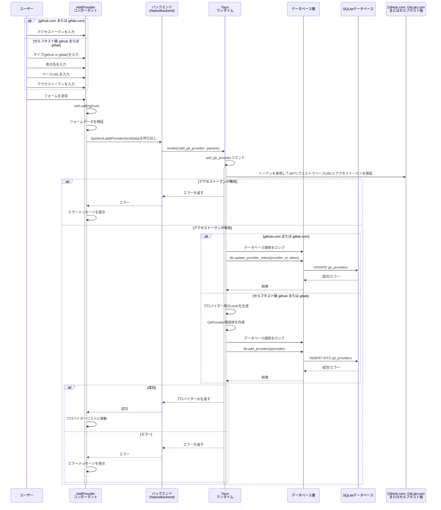

# プロバイダー追加・更新フロー

このドキュメントでは、アプリケーションに新しいGitプロバイダーを追加する際の操作シーケンスについて説明します。

## パターン

開発時とリリース時でバックエンドの実体が異なる.

* フロントエンド開発時: `MockBackend.ts`で処理する
* リリース時 (`npm run tauri build`でビルド時): `NativeBackend`で処理する
    * こちらがNormative Flow

## プロバイダー追加シーケンス図（Normative Flow）



## 実装詳細

### フロントエンド（AddProviderコンポーネント）

- 場所: `src/components/AddProvider.tsx`
- フォームの検証とユーザー入力処理
- 実際のバックエンドとの統合を実装済み
- エラーハンドリングとユーザーフィードバック機能付き

### バックエンド統合

- 場所: `src/backends/NativeBackend.ts`
- `AppBackend`インターフェイスの`addProvider`メソッドを実装
- Tauriの`add_git_provider`コマンドを呼び出し

### Tauriコマンドハンドラー

- 場所: `src-tauri/src/lib.rs:82-158`
- 関数: `add_git_provider`
- 新しいプロバイダー用のUUIDを生成
- トークン検証機能を実装
- `GitProvider`構造体をメタデータ付きで作成
- mutexで保護されたデータベース接続を通じて操作を処理

### データベース層

- 場所: `src-tauri/src/database.rs:327-350`
- 関数: `add_provider`
- `git_providers`テーブルへのSQL INSERTを実行
- タイムスタンプとデータのシリアル化を処理

## プロバイダーデータ構造

```rust
pub struct GitProvider {
    pub id: String,           // Tauriが生成するUUID
    pub name: String,         // ユーザーが提供する表示名
    pub provider_type: String, // "github" または "gitlab"
    pub base_url: String,     // API ベースURL
    pub token: Option<String>, // アクセストークン（オプション）
    pub token_valid: bool,    // トークンの検証状態
    pub last_sync: Option<DateTime<Utc>>, // 最後の同期タイムスタンプ
    pub updated_at: DateTime<Utc>, // レコード更新タイムスタンプ
}
```

## エラーハンドリング

このフローは複数のレベルでエラーハンドリングを実装しています：

1. フロントエンドのフォーム検証
2. バックエンドAPIのエラーハンドリング
3. Tauriコマンドのエラー伝播
4. データベース操作のエラーハンドリング

エラーはログに記録され、ユーザーインターフェイスに表示するために伝播されます。

## 実装されたエラーメッセージ

- **トークン検証エラー**: "GitHub token validation failed: [詳細]"
- **無効なトークン**: "Invalid access token. Please check your token and try again."
- **データベースエラー**: "Database error: [詳細]"
- **不明なプロバイダー**: "Unknown provider type: [type]"

すべてのエラーはフロントエンドで赤いエラーボックスとして表示され、ユーザーに適切なフィードバックを提供します。
