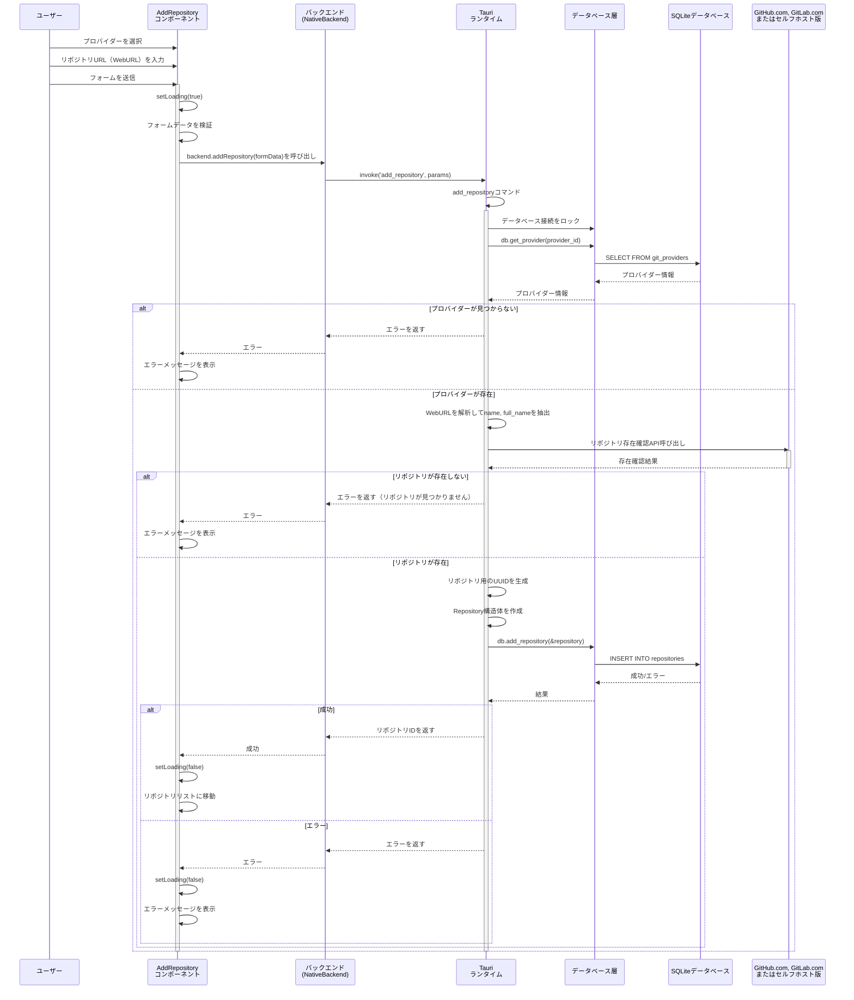

# リポジトリ追加・更新フロー

このドキュメントでは、アプリケーションに新しいリポジトリを追加する際の操作シーケンスについて説明します。

## パターン

開発時とリリース時でバックエンドの実体が異なる。

* フロントエンド開発時: `MockBackend.ts`で処理する
* リリース時 (`npm run tauri build`でビルド時): `NativeBackend`で処理する
    * こちらがNormative Flow

## リポジトリ追加シーケンス図（Normative Flow）



## 実装詳細

### フロントエンド（AddRepositoryコンポーネント）

- 場所: `src/components/AddRepository.tsx`
- フォームの検証とユーザー入力処理
- プロバイダー選択機能
- 実際のバックエンドとの統合を実装済み
- エラーハンドリングとユーザーフィードバック機能付き

### バックエンド統合

- 場所: `src/backends/NativeBackend.ts`
- `AppBackend`インターフェイスの`addRepository`メソッドを実装
- Tauriの`add_repository`コマンドを呼び出し

### Tauriコマンドハンドラー

- 場所: `src-tauri/src/lib.rs:290-337`
- 関数: `add_repository`
- プロバイダー情報の取得と検証
- WebURLの解析（name, full_name抽出）
- 新しいリポジトリ用のUUIDを生成
- `Repository`構造体をメタデータ付きで作成
- mutexで保護されたデータベース接続を通じて操作を処理

### データベース層

- 場所: `src-tauri/src/database.rs:492-520`
- 関数: `add_repository`
- `repositories`テーブルへのSQL INSERTを実行
- タイムスタンプとデータのシリアル化を処理

## リポジトリデータ構造

```rust
pub struct Repository {
    pub id: String,           // Tauriが生成するUUID
    pub name: String,         // WebURLから抽出されたリポジトリ名
    pub full_name: String,    // owner/repository形式の完全名
    pub web_url: String,      // ユーザーが入力したWebURL
    pub description: Option<String>, // リポジトリの説明（初期値はNone）
    pub provider_id: String,  // 関連するプロバイダーのID
    pub provider_name: String, // プロバイダーの表示名
    pub provider_type: String, // "github" または "gitlab"
    pub is_private: bool,     // プライベートリポジトリかどうか（初期値はfalse）
    pub language: Option<String>, // 主要な言語（初期値はNone）
    pub last_activity: Option<DateTime<Utc>>, // 最後のアクティビティ（初期値はNone）
    pub updated_at: DateTime<Utc>, // レコード更新タイムスタンプ
}
```

## エラーハンドリング

このフローは複数のレベルでエラーハンドリングを実装しています：

1. フロントエンドのフォーム検証
2. バックエンドAPIのエラーハンドリング
3. Tauriコマンドのエラー伝播
4. データベース操作のエラーハンドリング

エラーはログに記録され、ユーザーインターフェイスに表示するために伝播されます。

## 実装されたエラーメッセージ

- **プロバイダー取得エラー**: "Failed to get provider [provider_id]: [詳細]"
- **データベースエラー**: "Database error: [詳細]"
- **WebURL解析エラー**: "Invalid repository URL format"
- **リポジトリ存在確認エラー**: "Repository not found or access denied"
- **リポジトリ追加エラー**: "Failed to add repository to database: [詳細]"

すべてのエラーはフロントエンドで赤いエラーボックスとして表示され、ユーザーに適切なフィードバックを提供します。
