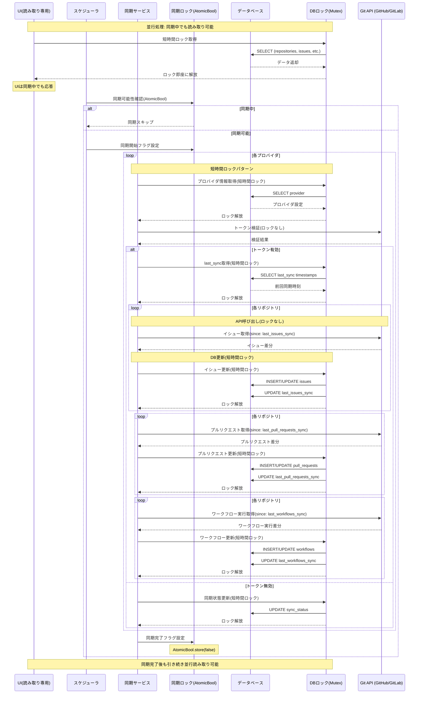

# 同期システム設計

## 概要

本アプリケーションの同期システムは、複数のGitプロバイダ（GitHub、GitLab）から Issues、Pull Requests、Workflows の情報を効率的に同期し、ユーザーに統合されたビューを提供します。

## ロック機構の設計

### 1. 同期ロック (Sync Lock)
**目的**: 同期処理の重複実行防止
- **実装**: `AtomicBool sync_in_progress`
- **スコープ**: アプリケーション全体の同期制御
- **動作**: 1つの同期プロセスのみ実行を許可

### 2. データベースロック (DB Lock)
**目的**: データベースアクセスの排他制御
- **実装**: `Arc<Mutex<Database>>`
- **スコープ**: 各データベース操作
- **動作**: 短時間の読み取り/書き込み保護

## システム構成



## ロック最適化戦略

### 1. 同期ロック管理
**実装**: RAII パターンによる自動解放
```rust
struct SyncGuard {
    db: Arc<Mutex<Database>>,
}

impl Drop for SyncGuard {
    fn drop(&mut self) {
        let db_guard = self.db.lock().unwrap();
        db_guard.sync_in_progress.store(false, Ordering::Release);
    }
}
```

### 2. データベースロック最小化
**戦略**: 各操作で短時間ロック→即座に解放

**Before (問題のあるパターン)**:
```rust
// 同期処理全体で長時間ロック
let mut db_guard = db.lock().unwrap();
db_guard.sync_provider(provider_id).await; // 数分間ロック保持
```

**After (最適化されたパターン)**:
```rust
// 1. プロバイダ取得 (短時間ロック)
let provider = {
    let db_guard = db.lock().unwrap();
    db_guard.get_provider(provider_id)?
}; // ロック即座に解放

// 2. API呼び出し (ロックなし)
let issues = api.fetch_issues(&provider, since).await?;

// 3. DB更新 (短時間ロック)
{
    let mut db_guard = db.lock().unwrap();
    db_guard.upsert_issues(&issues)?;
    db_guard.update_sync_timestamp(repo_id, "issues")?;
} // ロック即座に解放
```

### 3. SQLite WAL モード
**設定**: 読み取りと書き込みの並行実行を実現
```sql
PRAGMA journal_mode=WAL;
PRAGMA synchronous=NORMAL;
PRAGMA wal_autocheckpoint=1000;
PRAGMA temp_store=memory;
```

## 並行性の実現

### 1. 読み取り操作の最適化
**UIからのクエリ**: 同期中でも即座に実行可能
```typescript
// ダッシュボード表示
async fn get_issues() -> Result<Vec<Issue>> {
    let issues = {
        let db = db.lock().unwrap();
        db.get_issues(filters, pagination)?
    }; // 短時間ロック→即座に解放
    Ok(issues)
}
```

### 2. 同期処理の細分化
**リソース別分割**: Issues, PRs, Workflows を個別処理
- 各リソースで独立したsync timestamp
- API呼び出しとDB更新の分離
- エラー発生時も他リソースの処理継続

### 3. 非同期処理の活用
**ネットワーク処理**: DBロック外で実行
```rust
// API呼び出し (ロック不要)
let data = fetch_from_api(provider, since).await?;

// DB更新のみ短時間ロック
{
    let mut db = db.lock().unwrap();
    db.save_data(data)?;
}
```

## パフォーマンス特性

### 並行読み取り性能
- **同期中の読み取り**: 即座に実行 (WAL + 短時間ロック)
- **UI応答性**: 同期状態に関係なく高速
- **ダッシュボード更新**: リアルタイム表示

### ロック競合の最小化
- **ロック保持時間**: SQLクエリ実行時のみ
- **ロック粒度**: 操作単位の細分化
- **デッドロック回避**: 単一ロック順序

## 制限事項と考慮事項

### 技術的制約
- **SQLite接続**: 単一接続での排他制御が必要
- **Rustのメモリ安全性**: Sync/Send制約によるアーキテクチャ制限
- **同期の順序性**: データ整合性確保のため一部順次処理

### パフォーマンス考慮
- **WALファイル管理**: 定期的なcheckpoint処理
- **メモリ使用量**: 大量データ同期時の制御
- **API レート制限**: 外部API制約の遵守

## 監視とデバッグ

### ロック状態の可視性
```typescript
// 同期状態確認
isSyncInProgress(): Promise<boolean>

// ロック強制解除 (デバッグ用)
resetSyncLock(): Promise<void>
```

### パフォーマンス指標
- 同期処理時間の測定
- ロック競合の検出
- UI応答時間の監視

この設計により、同期処理中でもユーザーインターフェースが完全に応答性を維持し、真の並行処理が実現されます。