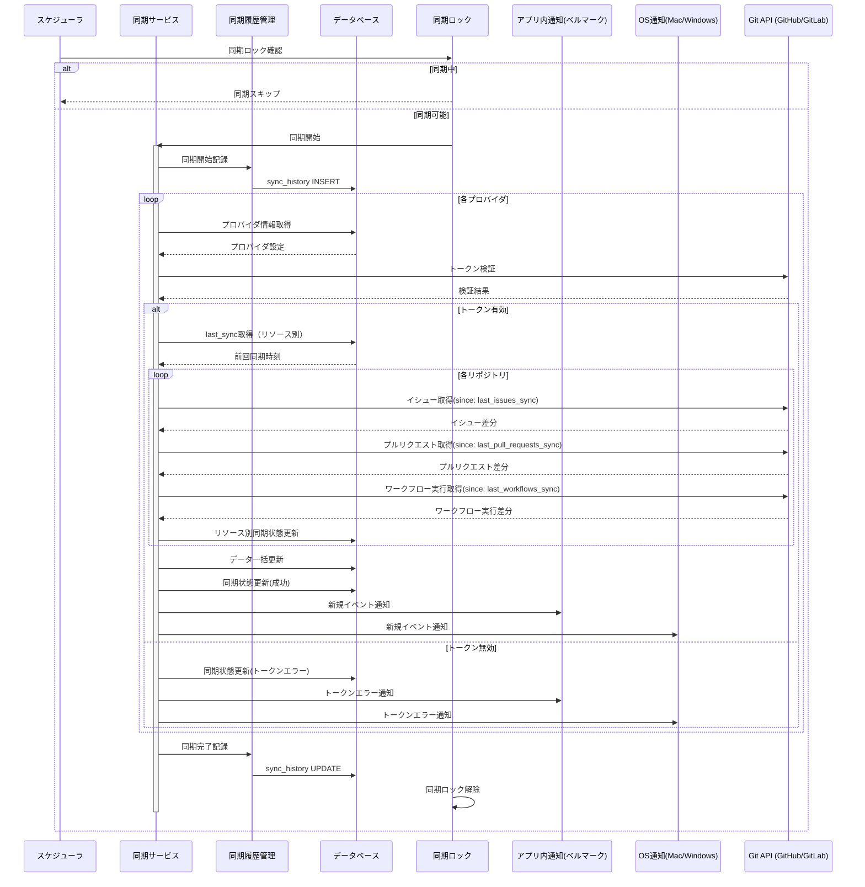

# 同期システム設計

## 概要

本アプリケーションの同期システムは、複数のGitプロバイダ（GitHub、GitLab）から Issues、Pull Requests、Workflows の情報を効率的に同期し、ユーザーに統合されたビューを提供します。

## システム構成



## 主要機能

### 1. 同期スケジューラ

**自動同期システム**
- バックグラウンドスレッドによる定期実行
- 設定可能な同期間隔 (`sync_interval_minutes`)
- 自動同期の有効/無効切り替え (`auto_sync_enabled`)
- リアルタイム設定変更対応

**実装場所**: `src-tauri/src/lib.rs`
```rust
pub struct SyncSettings {
    pub sync_interval_minutes: u64,
    pub auto_sync_enabled: bool,
}
```

### 2. 同期ロック機能

**排他制御システム**
- `AtomicBool`による同期の重複実行防止
- リアルタイム同期状態確認
- 同期ロック強制解除機能

**API:**
- `isSyncInProgress()` - 同期状態確認
- `resetSyncLock()` - 強制ロック解除

### 3. 同期履歴管理

**詳細なログシステム**
- 全同期実行の記録保存
- パフォーマンス指標の追跡
- エラー分析とデバッグ支援

**同期履歴データ構造:**
```typescript
interface SyncHistory {
  id: number;
  sync_type: string;           // 'provider', 'all_providers', 'repository'
  target_id: number | null;
  target_name: string;
  status: string;              // 'started', 'completed', 'failed'
  error_message: string | null;
  items_synced: number;        // 同期されたアイテム数
  repositories_synced: number; // 同期されたリポジトリ数
  errors_count: number;        // エラー数
  started_at: string;
  completed_at: string | null;
  duration_seconds: number | null;
}
```

### 4. リソース別同期管理

**きめ細かい同期制御**
- Issues、Pull Requests、Workflows 個別の同期タイムスタンプ
- リソース別同期ステータス管理
- 部分同期失敗時の継続実行

**リポジトリテーブル拡張:**
```sql
-- リソース別同期タイムスタンプ
last_issues_sync           TIMESTAMP,
last_pull_requests_sync    TIMESTAMP,
last_workflows_sync        TIMESTAMP,

-- リソース別同期ステータス
last_issues_sync_status_id          INTEGER,
last_pull_requests_sync_status_id   INTEGER,
last_workflows_sync_status_id       INTEGER,
```

### 5. 高度なエラーハンドリング

**堅牢なエラー処理**
- 部分成功の適切な処理
- 詳細なエラーメッセージ保存
- エラー統計の自動集計
- 継続可能なエラー回復

**エラー分類:**
- トークン認証エラー
- API通信エラー
- データベースエラー
- ネットワークエラー

### 6. UI統合機能

**ユーザーインターフェース**
- **履歴表示**: `History.tsx` - 同期実行履歴の詳細表示
- **設定管理**: `Settings.tsx` - 同期設定のリアルタイム変更
- **手動同期**: プロバイダ別・リポジトリ別手動実行
- **状態表示**: 同期進行状況のリアルタイム表示

## API エンドポイント

### 同期制御
```typescript
// 同期実行
syncProvider(providerId: number): Promise<void>
syncAllProviders(): Promise<void>
syncRepository(repositoryId: number): Promise<void>

// 状態管理
isSyncInProgress(): Promise<boolean>
getSyncStatus(): Promise<boolean>
resetSyncLock(): Promise<void>

// 設定管理
getSyncSettings(): Promise<SyncSettings>
updateSyncSettings(settings: SyncSettings): Promise<void>

// 履歴管理
getSyncHistory(limit?: number): Promise<SyncHistory[]>
```

## データベース設計

### 同期履歴テーブル
```sql
CREATE TABLE sync_history (
    id INTEGER PRIMARY KEY AUTOINCREMENT,
    sync_type TEXT NOT NULL,
    target_id INTEGER,
    target_name TEXT NOT NULL,
    status TEXT NOT NULL,
    error_message TEXT,
    items_synced INTEGER DEFAULT 0,
    repositories_synced INTEGER DEFAULT 0,
    errors_count INTEGER DEFAULT 0,
    started_at TIMESTAMP NOT NULL,
    completed_at TIMESTAMP,
    duration_seconds INTEGER,
    created_at TIMESTAMP DEFAULT CURRENT_TIMESTAMP,
    updated_at TIMESTAMP DEFAULT CURRENT_TIMESTAMP
);
```

### 同期ステータス管理
```sql
CREATE TABLE sync_statuses (
    id INTEGER PRIMARY KEY AUTOINCREMENT,
    code TEXT UNIQUE NOT NULL -- 'success', 'failure', 'in_progress'
);
```

## パフォーマンス特性

### 効率性
- **差分同期**: `since`パラメータによる増分更新
- **並列処理**: 複数リポジトリの並行同期
- **リソース最適化**: メモリ効率的なバッチ処理

### 可用性
- **エラー耐性**: 部分失敗時の続行
- **自動回復**: 一時的な障害からの自動復旧
- **ロック管理**: デッドロック防止機能

### 監視性
- **詳細ログ**: 全同期処理の追跡可能性
- **メトリクス**: パフォーマンス指標の自動収集
- **エラー分析**: 問題の迅速な特定と解決

## 制限事項

### 現在未実装の機能
- **通知システム**: アプリ内通知およびOS通知
- **リアルタイム進捗**: 同期中の詳細進捗表示
- **高度な再試行**: 失敗時の自動再試行機能

### 技術的制約
- **同期間隔**: 最小1分間隔
- **同時実行**: 1つの同期プロセスのみ
- **API制限**: 各プロバイダのレート制限に依存