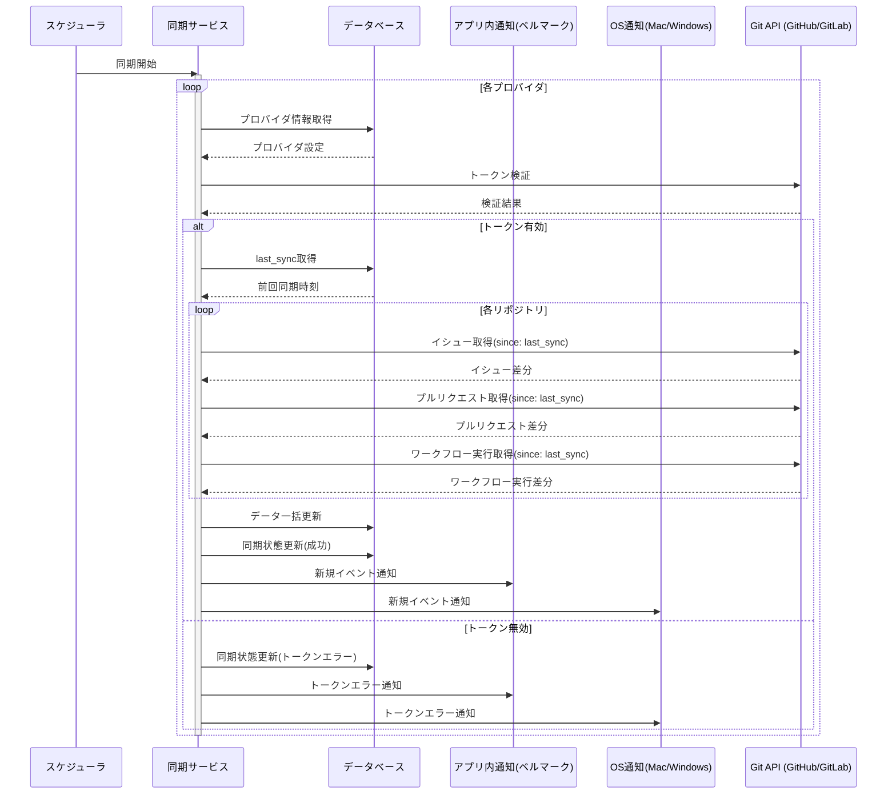

```mermaid
sequenceDiagram
    participant Scheduler as スケジューラ
    participant SyncService as 同期サービス
    participant DB as データベース
    participant InAppNotif as アプリ内通知(ベルマーク)
    participant OSNotif as OS通知(Mac/Windows)
    participant GitAPI as Git API (GitHub/GitLab)

    Scheduler->>SyncService: 同期開始
    activate SyncService

    loop 各プロバイダ
        SyncService->>DB: プロバイダ情報取得
        DB-->>SyncService: プロバイダ設定
        
        SyncService->>GitAPI: トークン検証
        GitAPI-->>SyncService: 検証結果
        
        alt トークン有効
            SyncService->>DB: last_sync取得
            DB-->>SyncService: 前回同期時刻
            
            loop 各リポジトリ
                SyncService->>GitAPI: イシュー取得(since: last_sync)
                GitAPI-->>SyncService: イシュー差分
                
                SyncService->>GitAPI: プルリクエスト取得(since: last_sync)
                GitAPI-->>SyncService: プルリクエスト差分
                
                SyncService->>GitAPI: ワークフロー実行取得(since: last_sync)
                GitAPI-->>SyncService: ワークフロー実行差分
            end
            
            SyncService->>DB: データ一括更新
            SyncService->>DB: 同期状態更新(成功)
            
            SyncService->>InAppNotif: 新規イベント通知
            SyncService->>OSNotif: 新規イベント通知
        else トークン無効
            SyncService->>DB: 同期状態更新(トークンエラー)
            SyncService->>InAppNotif: トークンエラー通知
            SyncService->>OSNotif: トークンエラー通知
        end
    end
    
    deactivate SyncService
```